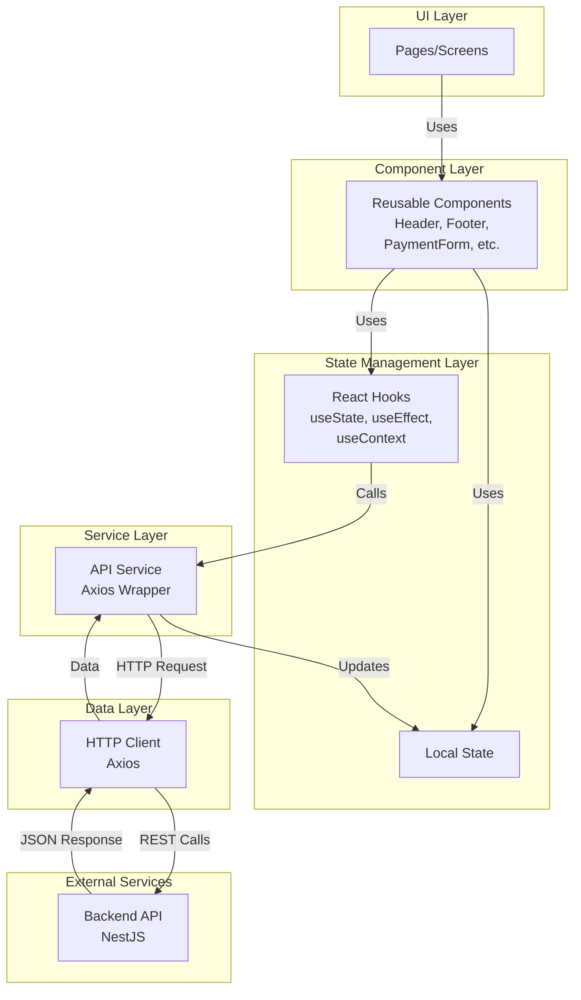
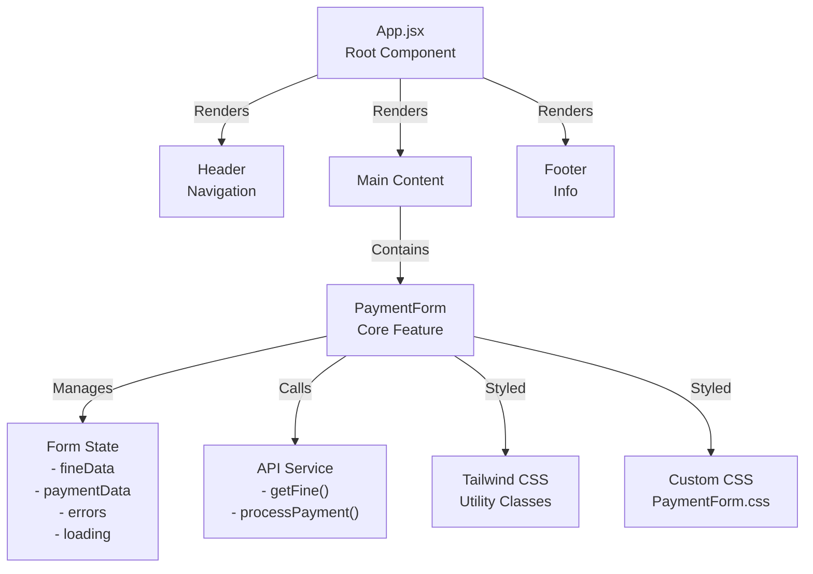
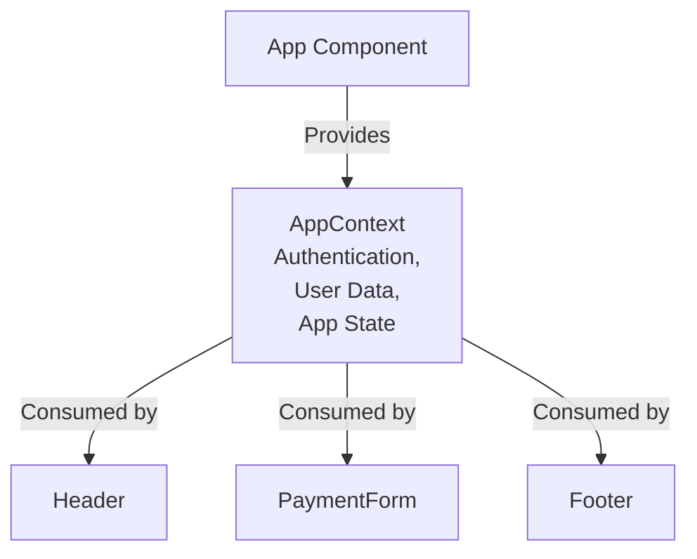
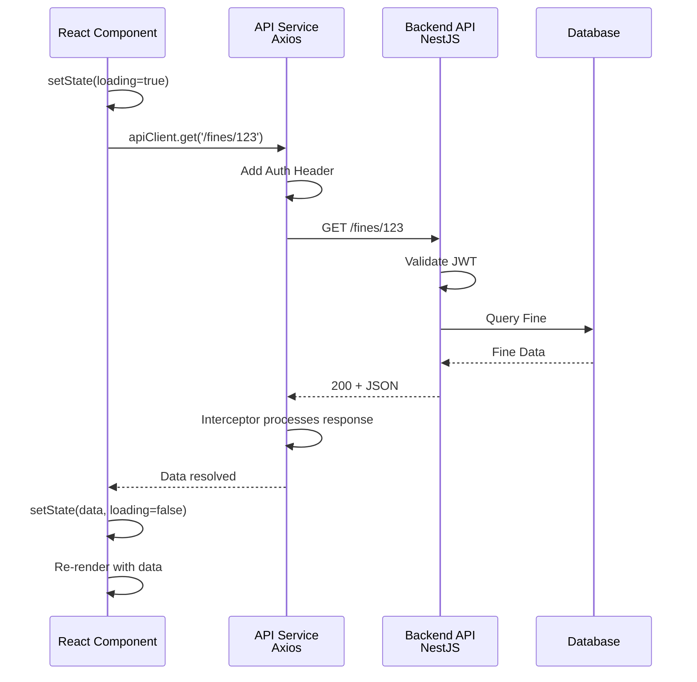
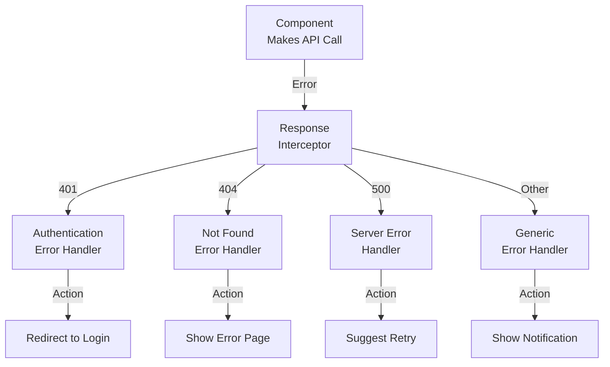

# Web Frontend Architecture Guide

## Overview

The Traffic Fine System web frontend is a React-based single-page application (SPA) built with Vite, styled with Tailwind CSS, and communicates with the NestJS backend via REST API using Axios.

---

## Frontend Architecture Layers



---

## Project Structure

```
traffic-fine-system-web-frontend/
├── src/
│   ├── components/
│   │   ├── Header.jsx           # Navigation component
│   │   ├── Footer.jsx           # Footer component
│   │   ├── PaymentForm.jsx      # Main payment form
│   │   └── PaymentForm.css      # Form styling
│   ├── services/
│   │   └── apiClient.js         # (To be created) Axios configuration
│   ├── hooks/
│   │   └── (To be created)      # Custom React hooks
│   ├── utils/
│   │   └── (To be created)      # Utility functions
│   ├── App.jsx                  # Root component
│   ├── App.css                  # Global styles
│   └── main.jsx                 # Entry point
├── public/
│   └── (Static assets)
├── index.html                   # HTML template
├── vite.config.js              # Vite configuration
├── tailwind.config.js          # Tailwind configuration
├── postcss.config.js           # PostCSS configuration
├── eslint.config.js            # ESLint configuration
└── package.json                # Dependencies
```

---

## Component Architecture

### Component Hierarchy



### Component Details

#### Header Component

```jsx
// Location: src/components/Header.jsx
// Purpose: Navigation and branding
// Props: None (can be extended for user info)
// State: None (stateless functional component)
// Dependencies: React, Tailwind CSS
```

#### Footer Component

```jsx
// Location: src/components/Footer.jsx
// Purpose: Footer information and links
// Props: None
// State: None (stateless functional component)
// Dependencies: React, Tailwind CSS
```

#### PaymentForm Component

```jsx
// Location: src/components/PaymentForm.jsx
// Purpose: Main payment processing interface
// Props: None
// State:
//   - fineId: string
//   - amount: number
//   - errors: object
//   - loading: boolean
//   - success: boolean
// Methods:
//   - handleInputChange()
//   - handleSubmit()
//   - fetchFineDetails()
//   - processPayment()
// Dependencies: React, Axios, Tailwind CSS
```

---

## State Management

### Current Approach: Local State with Hooks

The application currently uses React Hooks for local state management:

```jsx
// Example pattern used in components
const [data, setData] = useState(initialValue)
const [loading, setLoading] = useState(false)
const [error, setError] = useState(null)

useEffect(() => {
  // Side effects
}, [dependencies])
```

### Future Enhancement: Context API



---

## API Communication

### Axios Service Pattern

```jsx
// src/services/apiClient.js (To be created)

import axios from 'axios'

const apiClient = axios.create({
  baseURL: process.env.VITE_API_BASE_URL || 'http://localhost:3000',
  timeout: process.env.VITE_API_TIMEOUT || 5000,
})

// Request interceptor for JWT token
apiClient.interceptors.request.use(config => {
  const token = localStorage.getItem('authToken')
  if (token) {
    config.headers.Authorization = `Bearer ${token}`
  }
  return config
})

// Response interceptor for error handling
apiClient.interceptors.response.use(
  response => response,
  error => {
    if (error.response?.status === 401) {
      // Handle unauthorized - redirect to login
    }
    return Promise.reject(error)
  }
)

export default apiClient
```

### API Call Flow



---

## Styling Strategy

### Tailwind CSS Integration

The project uses Tailwind CSS utility-first approach:

```jsx
// Example from App.jsx
<div className="min-h-screen flex flex-col bg-neutral-bg">
  <Header />
  <main className="flex-grow flex items-center justify-center px-4 py-8">
    <PaymentForm />
  </main>
  <Footer />
</div>
```

### Utility Classes Used

| Class            | Purpose                         |
| ---------------- | ------------------------------- |
| `min-h-screen`   | Minimum height of full viewport |
| `flex flex-col`  | Flexbox column layout           |
| `bg-neutral-bg`  | Background color                |
| `flex-grow`      | Flexible growth                 |
| `items-center`   | Vertical centering              |
| `justify-center` | Horizontal centering            |
| `px-4 py-8`      | Padding (horizontal & vertical) |

### Custom CSS

```css
/* src/components/PaymentForm.css */
/* Component-specific styles */

.payment-form {
  /* Custom styling not available in Tailwind */
}

.form-input {
  /* Input field styling */
}

.form-button {
  /* Button styling */
}
```

---

## Build & Development Setup

### Development Server

```bash
# Start development server on http://localhost:5173
npm run dev
```

### Build Process

```bash
# Production build
npm run build
# Creates optimized dist/ folder

# Preview production build locally
npm run preview
```

### Vite Configuration

```js
// vite.config.js
import { defineConfig } from 'vite'
import react from '@vitejs/plugin-react'

export default defineConfig({
  plugins: [react()],
  server: {
    port: 5173,
    proxy: {
      '/api': {
        target: 'http://localhost:3000',
        changeOrigin: true,
      },
    },
  },
})
```

---

## Error Handling Strategy

### Component-Level Error Handling

```jsx
// Pattern for handling errors in components
const [error, setError] = useState(null)

const fetchData = async () => {
  try {
    setError(null)
    const response = await apiClient.get('/endpoint')
    // Handle success
  } catch (err) {
    setError(err.response?.data?.message || 'An error occurred')
    // Display error to user
  }
}
```

### Global Error Handling



---

## Performance Optimization

### Current Optimizations

- Vite's fast HMR (Hot Module Replacement)
- Tailwind CSS JIT compilation
- ESLint for code quality
- Prettier for consistent formatting

### Recommended Enhancements

#### 1. Code Splitting

```jsx
// Lazy load components
import { lazy, Suspense } from 'react'

const PaymentForm = lazy(() => import('./components/PaymentForm'))

function App() {
  return (
    <Suspense fallback={<div>Loading...</div>}>
      <PaymentForm />
    </Suspense>
  )
}
```

#### 2. Memoization

```jsx
// Prevent unnecessary re-renders
import { memo } from 'react'

const Header = memo(() => {
  return <header>...</header>
})
```

#### 3. Image Optimization

```jsx
// Use modern image formats
<picture>
  <source srcSet="image.webp" type="image/webp" />
  
</picture>
```

#### 4. Caching Strategy

```jsx
// Cache API responses
const cache = new Map()

const getCachedData = async url => {
  if (cache.has(url)) {
    return cache.get(url)
  }
  const data = await apiClient.get(url)
  cache.set(url, data)
  return data
}
```

---

## Testing Strategy

### Unit Tests (Jest)

```jsx
// Example test for component
import { render, screen } from '@testing-library/react'
import Header from '../components/Header'

test('renders header', () => {
  render(<Header />)
  const linkElement = screen.getByText(/Traffic Fine/i)
  expect(linkElement).toBeInTheDocument()
})
```

### Integration Tests

```jsx
// Test component interactions
import { render, screen, fireEvent } from '@testing-library/react'
import PaymentForm from '../components/PaymentForm'

test('submits form with data', async () => {
  render(<PaymentForm />)
  fireEvent.change(screen.getByLabelText(/Fine ID/i), {
    target: { value: '123' },
  })
  fireEvent.click(screen.getByText(/Submit/i))
  // Assert behavior
})
```

---

## Security Best Practices

### 1. Authentication

- Store JWT tokens securely (httpOnly cookies preferred)
- Include token in Authorization header for API requests
- Implement token refresh mechanism

### 2. Input Validation

- Validate all user inputs on the client side
- Implement server-side validation as well
- Sanitize user data before display

### 3. HTTPS

- Always use HTTPS in production
- Enable HSTS headers
- Use secure cookies

### 4. CORS

- Configure proper CORS headers on backend
- Only allow trusted origins

### 5. Environment Variables

```env
# .env.local (Not committed to git)
VITE_API_BASE_URL=https://api.example.com
VITE_API_KEY=your-api-key
VITE_ENVIRONMENT=production
```

---

## Deployment

### Frontend Deployment Options

#### 1. Vercel

```bash
npm install -g vercel
vercel
```

#### 2. Netlify

```bash
npm run build
# Deploy dist/ folder to Netlify
```

#### 3. Traditional Web Server

```bash
npm run build
# Upload dist/ to web server (nginx/Apache)
```

### Build Output

```
dist/
├── index.html
├── assets/
│   ├── index-[hash].js
│   ├── index-[hash].css
│   └── vendor-[hash].js
└── vite.svg
```

---

## Development Workflow

### 1. Local Development

```bash
npm install
npm run dev
# Open http://localhost:5173
```

### 2. Code Changes

- Edit components in `src/`
- Hot reload automatically applies changes
- Check console for errors

### 3. Testing

```bash
npm run test          # Run tests
npm run test:watch   # Watch mode
npm run test:cov     # Coverage report
```

### 4. Linting & Formatting

```bash
npm run lint          # Check for errors
npm run format        # Auto-format code
```

### 5. Production Build

```bash
npm run build         # Create optimized build
npm run preview       # Test production build locally
```

---

## Common Development Tasks

### Adding a New Component

1. Create component file: `src/components/MyComponent.jsx`
2. Create styles if needed: `src/components/MyComponent.css`
3. Import in parent component or App.jsx
4. Add tests: `src/components/MyComponent.test.jsx`

### Adding API Integration

1. Create service method in `src/services/apiClient.js`
2. Use in component with `useEffect` hook
3. Handle loading and error states
4. Display data in JSX

### Adding Routing (Future)

```jsx
import { BrowserRouter, Routes, Route } from 'react-router-dom'

function App() {
  return (
    <BrowserRouter>
      <Routes>
        <Route path="/" element={<Home />} />
        <Route path="/payment" element={<PaymentForm />} />
      </Routes>
    </BrowserRouter>
  )
}
```

---

## Useful Resources

- [React Documentation](https://react.dev/)
- [Vite Documentation](https://vitejs.dev/)
- [Tailwind CSS Documentation](https://tailwindcss.com/)
- [Axios Documentation](https://axios-http.com/)
- [MDN Web Docs](https://developer.mozilla.org/)

---

## Next Steps

1. ✅ Review this architecture document
2. ⬜ Create API service wrapper (`src/services/apiClient.js`)
3. ⬜ Implement error handling patterns
4. ⬜ Add routing (React Router)
5. ⬜ Implement authentication UI
6. ⬜ Add unit tests
7. ⬜ Setup CI/CD pipeline
8. ⬜ Implement caching strategy
